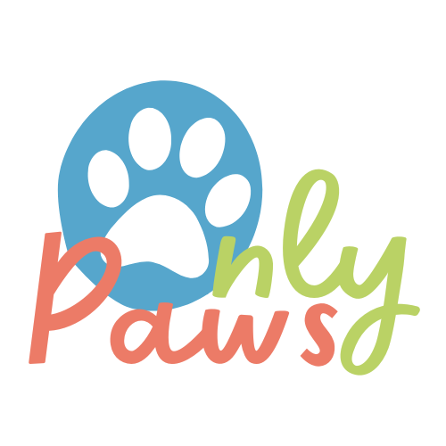
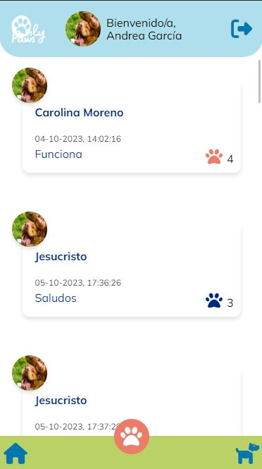
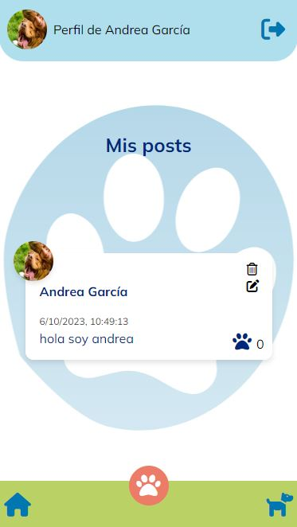
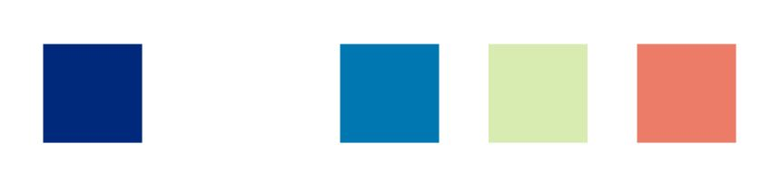
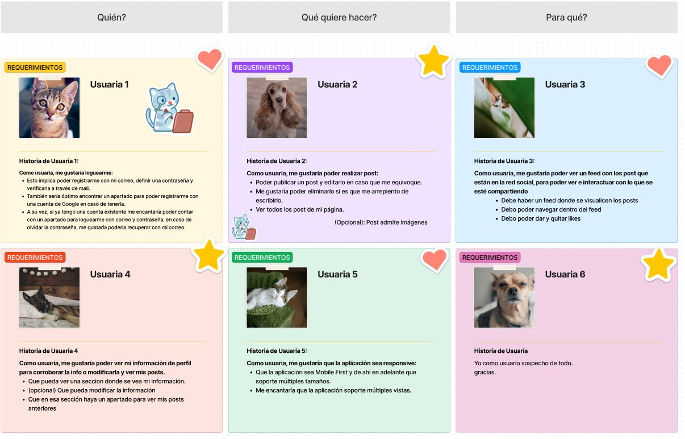
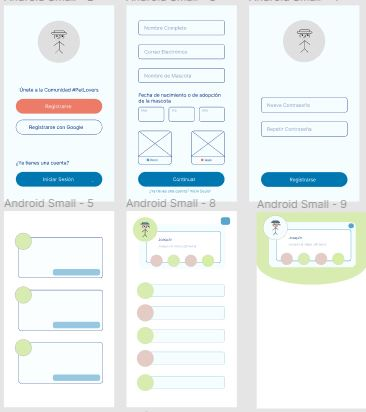

# OnlyPaws

Es una red social para compartir con Amigos,Familia entre otros, tus bellos momentos y experiencias con tus mascotas.

## Descripción de la App

OnlyPaws al momento de abrir la aplicación te recibe con 3 imagenes encantadoras con las que te define
para lo que puedes usar la red social, se manejan en modo carrusel y mientras haces click puedes verlas.
Lo hicimos como una manera de adentrarte en lo que es la app antes de iniciar sesion o registrarte como un entretenido
preambulo.

- Despues de dar click en saltar esta la parte en la que puedes iniciar sesion, ya sea con una cuenta que tu ya creaste,
o por medio de Google.En caso contrario da la opcion de registrarse.

- Iniciando sesión con Google:
  Al seleccionar el botón de Google se abrirá una ventana
  emergente que provee google y de esa manera inicias sesion como normalmente lo haces cuando usas google.
  automaticamente te redigira al Feed donde ya estara dandote la bienvenida con tu nombre con el cual creaste la cuenta de google.
- Registrándose:
  En esta vista el usuario debe ingresar su correo electrónico,
  nombre de usuario, contraseña y confirmación de la misma.
- Iniciando sesión con correo y contraseña:
  Aqui el usuario debe colocar unicamente el correo y contraseña para poder ingresar al Feed, posteriormente lograndolo de manera correcta te redirige al feed dandote la bienvenida con el nombre de usuario que pusiste al registrarte.

En cualquiera de los 2 metodos para iniciar sesión se abrira automaticamente el Feed, donde podremos apresiar todos los post de los usuarios que se han logueado, te recibira con una bienvenida en el header y en la parte superior derecha un icono para cerrar sesión cada que gustes.
abajo del header se encuentra el area de post, compuesta por el post que escribes, un boton para editar, uno para borrar, uno para darle like que al mismo tiempo cuenta con conteo del mismo para saber cuantos usuarios les ah gustado tu publicación y a la ves el nombre de quien escribio el Post.

En la parte inferior se encuentran 3 iconos, en la parte de la izquierda es el boton de home, en dado caso estes en tu perfil al momento de presionarlo te redirige al feed, el boton de la Paw que se encuentra en medio que sirve para escribir un nuevo post y por ultimo el boton de la derecha que es para dirigirte a tu perfil que se encuentra con forma de un perrito.

Los usuarios pueden de esa manera interactuar entre si por medio de los likes, al mismo tiempo que ver que día y a que hora se publicaron los post.

La app fue construida como SPA y es responsive.

## Imagenes de la APP de OnlyPaws:

### FEED

### PERFIL

## Planificación:

La manera que nos organizamos para realizar este proyecto fue por Figma y Notion, de esta manera pudimos crear los prototipos en la primera y en Notion poner los pendientes que se iban generando para asi mantener un orden y saber que ir haciendo o que faltaba. 
 
   [✔️] Escogimos paleta de colores. 

  

   [✔️]Realizamos las historias de Usuario: 

  
 

  [✔️] Elaboramos prototipos con la herramienta Figma.

  
 

  [✔️] Aplicamos test .

  
  

